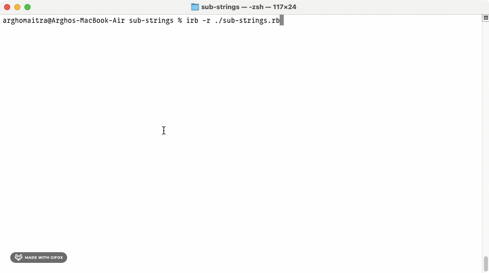

# sub-strings
A Hash of Sub Strings from the Original String

## Demo

## General Info

**sub-strings** is the [second project](https://www.theodinproject.com/lessons/ruby-sub-strings) in the [Ruby Course](https://www.theodinproject.com/paths/full-stack-ruby-on-rails/courses/ruby) from the [Full Stack Ruby on Rails](https://www.theodinproject.com/paths/full-stack-ruby-on-rails) path in the [The Odin Project](https://www.theodinproject.com/about).

## Technologies

+ ***CLI***
+ ***Git***
+ ***GitHub***
+ ***Ruby***

## Self-reflections

> It took quite some time to reach here. I always keep the stuff I learnt about motivation and mindset in the beginning part of the odin project close to my heart. It has proved valuable in overcoming many of the challenges that I've faced as of now.

> This was also an easy project. I learned a whole lot about installing Ruby and all the different basic Ruby tidbits prior to starting this project. Previously learned
knowledge of hashes and arrays (along with converting string to/from arrays) makes it very easy to solve this exercise.

## Contact and Support

+ Feel free to contact ***mitrohgr_03505*** on discord for project-related queries.
+ No further feature modifications or improvements will be done to this project.